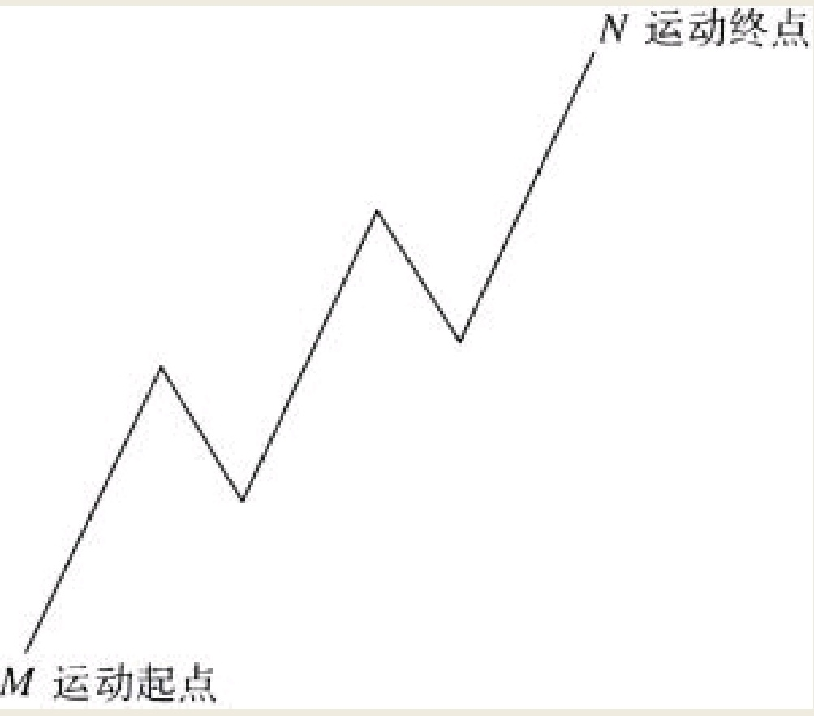
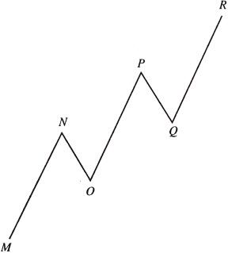

人类的心理波动是有规律的，它们总是以特定数目的波浪前进并且方向明确。
```
所有的人类活动都不例外，不论是企业、政府还是娱乐业。这种现象在公众自由参与的交易市场的价格波动中体现得尤为突出。诸如债券、股票和商品的价格运动，用波浪理论来研判与分析显得尤为合适。本书运用股市价格运动来阐述波浪现象。本书中我们所论述的全部原理，同样适用于可以记录下所有人类活动的各个领域。
```
一轮完整的波浪运动由五浪构成。为什么会是五，而不是其他的数字，这是宇宙的秘密之一，我不会详细解释它。根据我们观察，数字五在自然界其他事物的运动变化中也相当常见。无论如何，对于整个社会演变趋势来讲，五个浪是最为基础的，人们不必追究其原因就可以接受此观点。
```
我们就拿人体来讲，从躯干开始就有五个延伸之处，即头部、两条腿和两条手臂；从头部开始又有五个延伸之处，即两只耳朵、两只眼睛和鼻子；从每个手臂开始又有五个延伸之处，即以五指的形式出现。而每个腿又有五个延伸之处，以脚趾形式出现。一个人固有五种物理感觉，即味觉、嗅觉、视觉、触觉以及听觉。这种现象在其他许多领域都会近似地出现。
```
## 五个浪
形成一轮完整运动的五个浪之中，有三个浪的运动方向与主要运动方向相同，另外两个浪在相反的方向上前进。
- 第一浪、第三浪和第五浪代表着向前的驱动力，我们称之为驱动浪；
- 第二与第四浪代表着向后的驱动力，我们称之为调整浪。换句话说，以奇数表示的波浪运行在主方向上；以偶数表示的波浪则与主方向相反。
图1


一个浪级的五个浪，将构成下一个更大级别波浪的第一浪。举例来说，如图1所示，市场从M点开始运行，至N点走出了五个浪。然而进一步如图2所示，M至N点的运动，只不过属于M至R的一轮五浪运动的一个浪而已。可以依次类推，M至R的运动只不过是更高级别波浪运动的第一浪罢了。
图2

