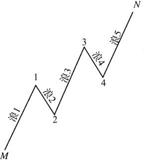
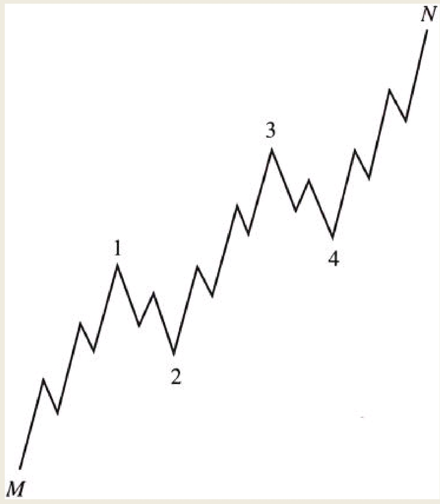
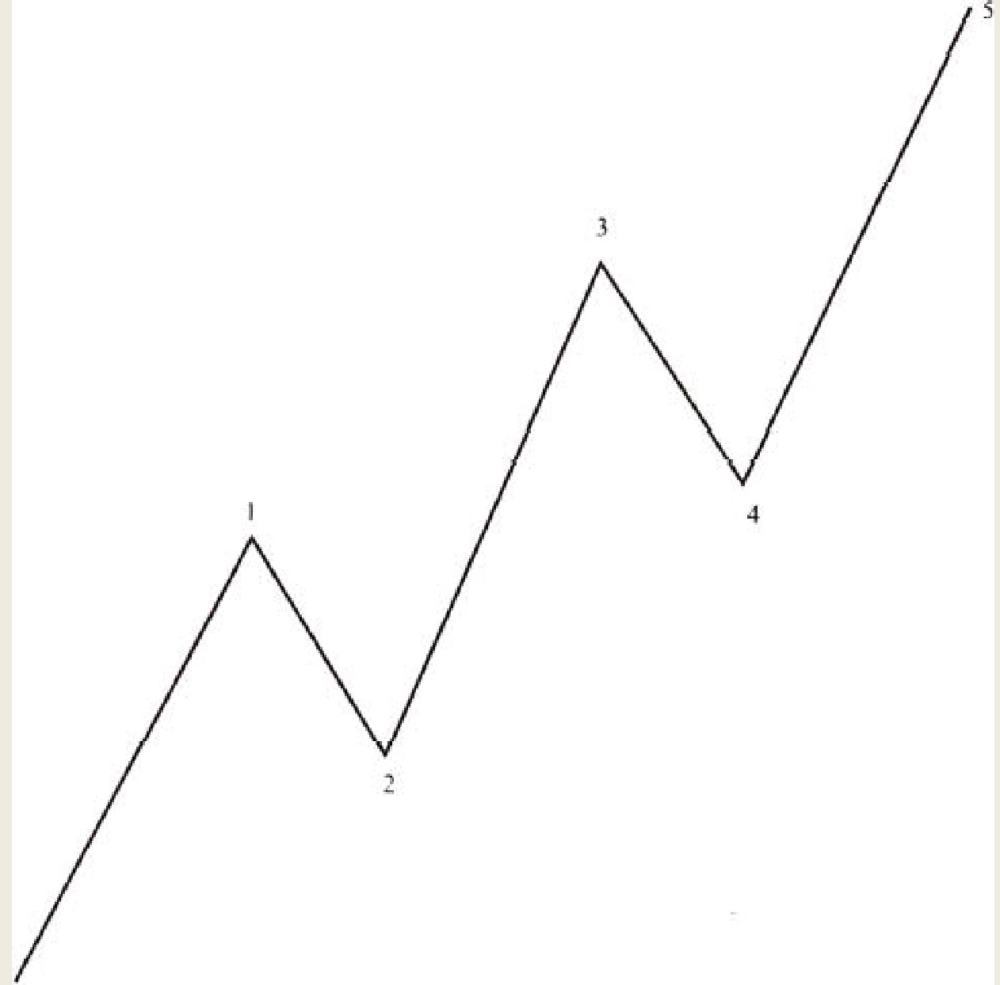
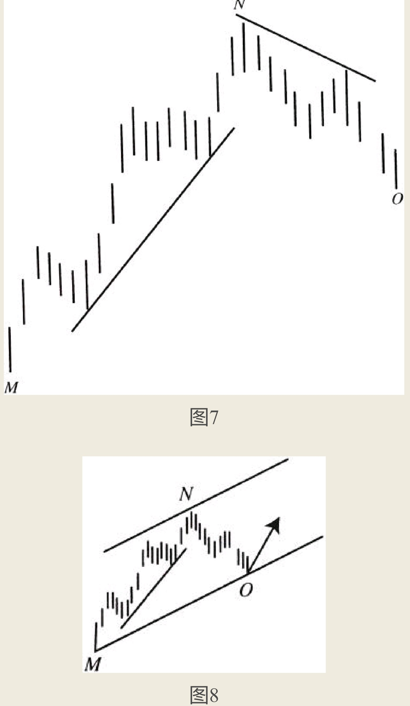
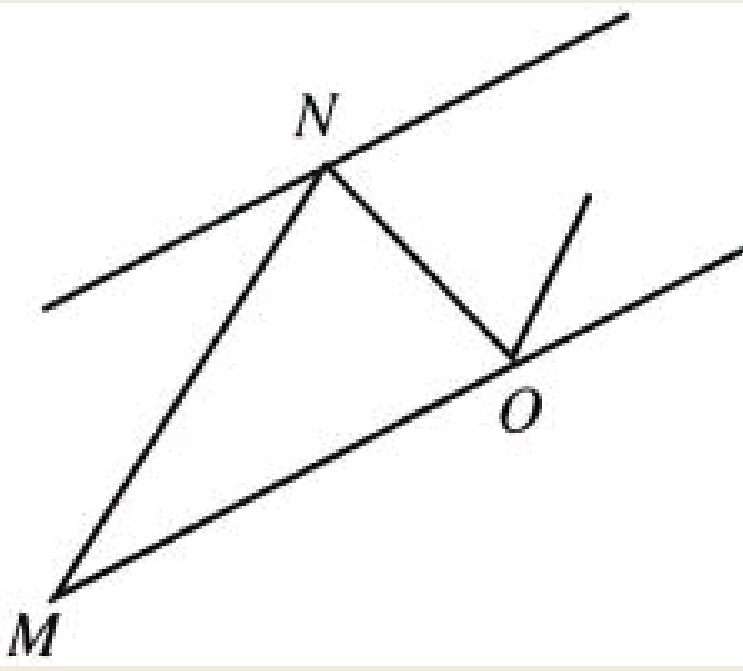
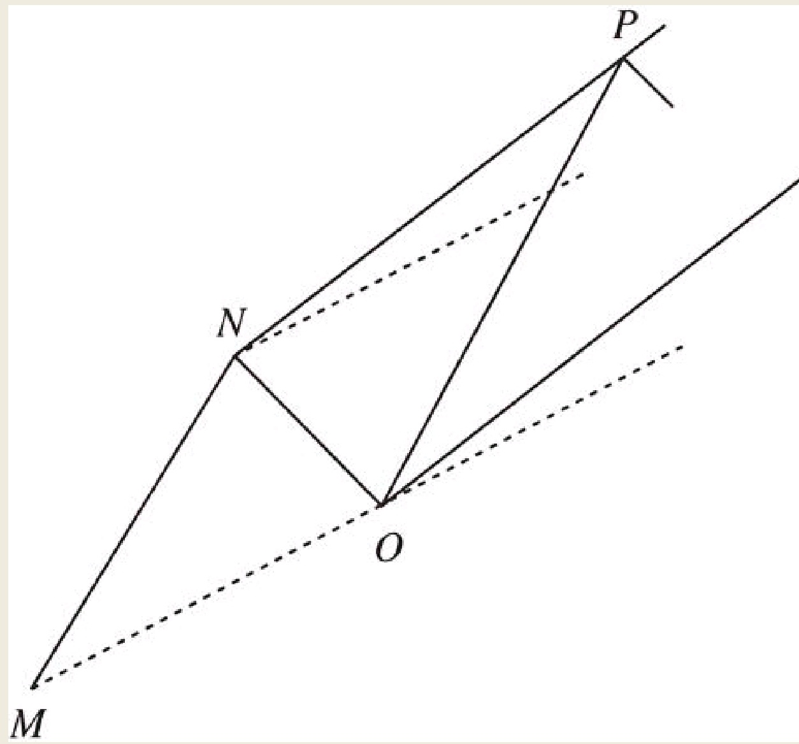
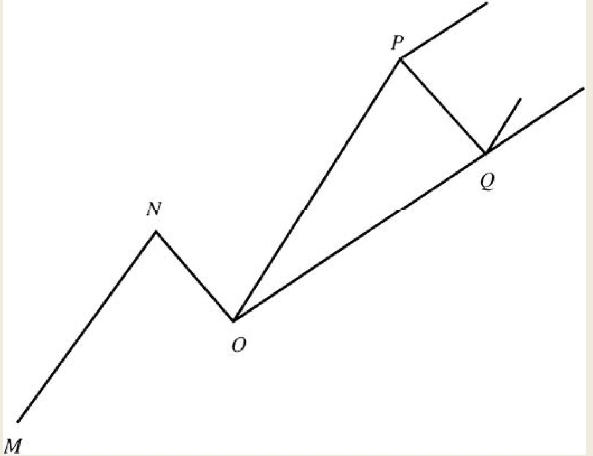

浪1、浪3与浪5是主要方向上的浪，而浪2与浪4是朝着相反方向运动的浪。浪2扮演着对浪1进行回调的作用，浪4扮演着对浪3进行回调的作用。
主要方向上的浪与相反方向上的浪之间的区别是：
前者可以分解成更小级别的五个浪，而后者则只能分解成更小级别的三个浪。前文讨论的M至N的波浪运动如图3所示。


等到浪4彻底走完的时候，无论它正好踩着新基线，还是穿越于新基线上下，我们都可以绘制出最终通道。最终通道无比重要，因为它能够帮助我们定位第五浪，也就是预测最后一浪的位置。鉴于该浪是此轮市场运动的终点，投资者此时必然关心是否平仓及其盈利水平。最终通道可以这样得到：首先，绘制一条连接浪2终点

把MN这一段价格运动进一步细分成为更小级别的波浪，如图4所示。请读者注意，在图4中，第二浪（点1到点2）与第四浪（点3到点4）分别都是由三个更小级别的波浪组成。然而第一浪、第三浪和第五浪分别都是由五个更小级别的波浪组成。


从这幅图之中，我们可以总结出如下规律，这些规律对于整个波浪理论来讲都是最为基础性的：
- （1）主要方向上的波浪，或者说是奇数浪，由五个更小级别的波浪组成。
- （2）调整浪，即朝着相反方向运行的偶数浪，由三个更小级别的波浪组成。
观察一下图4中点1到点2的市场运动。这一段是从M至N的完整五浪运动中的浪二，正如所有调整运动所必然遵循的规律那样，它由三个浪组成。

## 奇数浪称作基本浪，偶数浪称作调整浪
方便讲解，我们把一轮运动中的奇数浪称作基本浪（也可以称之为驱动浪），同时把偶数浪称作调整浪。请读者记住，驱动浪包括五个更小级别的波浪，而调整浪包括三个更小级别的波浪。关于波浪理论的其他规律与要点继续论述如下。

研究个股时您会发现某些股票在上涨，而其他的股票却在下跌，或者说正在进行一种横向调整运动。尽管如此，就某一段时间而言，个股中的绝大多数通常都会亦步亦趋，这导致平均价格指数，或者称之为总体市场，会呈现出波浪运动的状态。可以看出，平均价格指数涵盖的股票越多，所呈现出的波浪形态就会越完美。

## 波浪的波动幅度与持续时间不会千篇一律
由五浪组成的一轮完整市场运动，总是会受到一个或者多个基本面因素的影响。但是，由三个驱动浪（浪1、浪3和浪5），以及它们的两个调整浪（浪2与浪4）所构成的价格运动，会以某种方式使自己不断适应于当前的基本面形势。波浪运动背后的基本面因素，在其对整个波浪形态的影响发挥殆尽之前通常不容易被人们识别出来。
但是在波浪前进的过程之中，时事新闻对于每一浪而言都有效力，它们会不断地修正每一浪的波动幅度和持续时间。
## 一般而言，我们观察浪3将会比浪1走得更远，而浪5将会比浪3涨得更高
同样道理，浪4不应该回探到浪2的水平。浪2很少会丢掉浪1已经占领的全部地盘，浪4很少会丢掉浪3已经占领的全部地盘。这就意味着一轮完整的五浪运动，在走势上通常是倾斜的，如图6所示。


如果要准确地把握一轮市场走势，并正确地识别出这一轮走势之中的各段波浪，读者应当认识到，市场走势通常都是处于两条平行直线相夹的通道之中。大多数文具店都会出售平行尺，使用这样一种文具可以帮助您快速地定位通道所处的位置。

## 画图确认
在浪1与浪2尚未走完之前，我们无法着手对通道进行定位。
如图7所示，浪1与浪2已经走完，市场露出了三个明显的节点，也可以说成是明显凸出的拐点。
第一个凸出的拐点是浪1的起点；
第二个凸出的拐点是浪1的终点，同时也是浪2的起点；
第三个凸出的拐点是浪2的终点。
```
为了便于讲解，我们把这些节点记作M点、N点和O点。为了画出通道的两条直线，我们首先连接凸出的拐点M点和O点绘制一条基线。接下来我们可以通过N点画出一条平行于基线的直线，我们把这条直线称之为上通道线。将这条上通道线向上延长到N点的右边。基线和上通道线画出之后，通道就会如图8和图9那样展现在您的面前。
```



图9

## 绘制
波浪3通常应该在上通道线位置附近停下它的脚步。如果浪3跑出了上通道线，则显示市场运动步伐已呈现暂时性的强劲之势；
如果浪3在上通道线之下停步，则显示上攻力度出现暂时疲软之势。
无论如何，等到浪3走完的时候，我们就可以放弃旧通道，而绘制新通道。
新通道的具体绘制方法是：首先画出一条连接N点和P点（或者称之为浪1和浪3终点）的直线作为上通道线。接下来，穿过凸出的拐点O点，画出一条平行于上通道线的直线作为基线。就在这条基线附近，应当是浪4停步之处。图10之中的虚线和实线分别代表旧通道（或称为废弃通道）和新通道。显而易见，假如波浪3正好在穿过N点的旧通道的上通道线上停步，则新通道与旧通道会合而为一。


## 浪4彻底走完，非常关键
等到浪4彻底走完的时候，无论它正好踩着新基线，还是穿越于新基线上下，我们都可以绘制出最终通道。最终通道无比重要，因为它能够帮助我们定位第五浪，也就是预测最后一浪的位置。
鉴于该浪是此轮市场运动的终点，投资者此时必然关心是否平仓及其盈利水平。最终通道可以这样得到：首先，绘制一条连接浪2终点点以及浪4终点Q点的直线得到基线。接下来，穿过浪3的终点P点，画出一条平行于基线的直线得到上通道线，如图11所示。出于简洁直观的目的，前图之中第一条和第二条废弃通道，已经在图中略去了。波浪5通常应该在那条上通道线的附近走完。
```
出于对这一浪的重要性的考虑，本书在后续波浪特点的讨论中会更加深入地对此加以论述。
```


等到第5浪走完时，市场往往会出现一轮向下的杀跌运动，我们称之为调整。这次调整的动作，要比前文谈论的通道中出现的那些调整浪的幅度要大。
这一个调整浪，成为下一个更高级别波浪运动的浪2。同样道理先前第一轮五浪，现在已经重新标示成下一轮更高级浪的浪1。沿着相同的思路，我们可以从浪2的终点开始，继续在更高的波浪级别上进行通道分析。