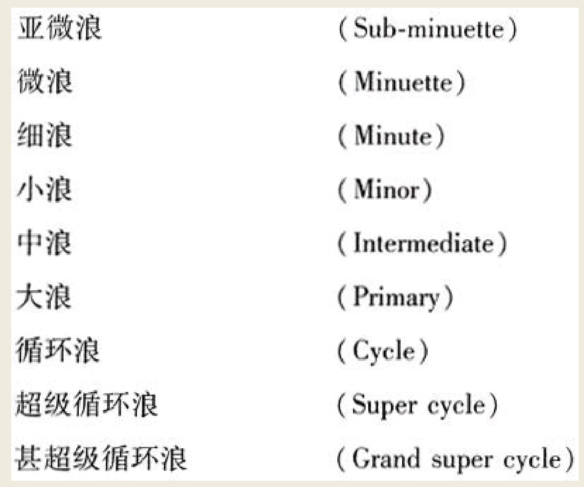
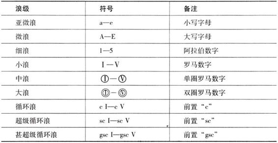
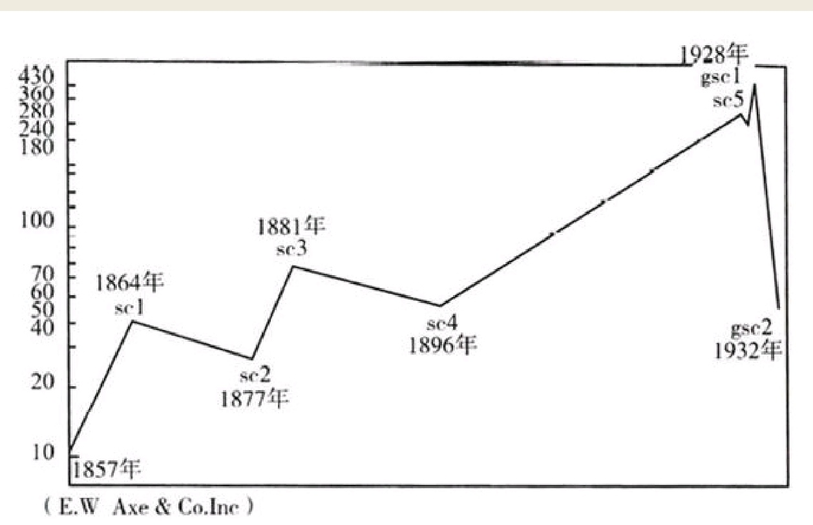
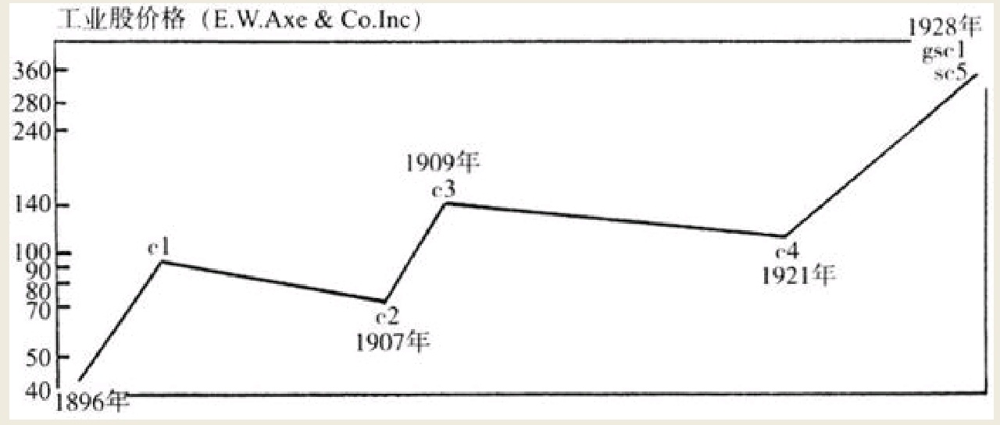
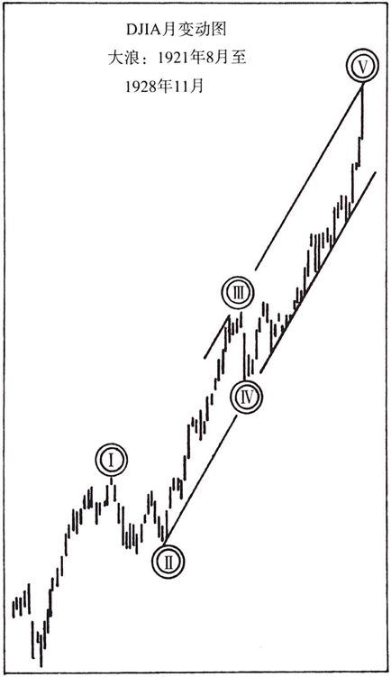

下面给出的波浪名称，其顺序是按照级别由低到高排列。一个浪级的五个浪，将会构成下一个更高级别波浪之中的第一浪。举例来说，五个亚微浪能够组成微浪中的浪一，而五个微浪又相当于细浪中的浪一，以此类推。九个级别的波浪按顺序列举如下：


在市场波浪图上用符号标注波浪时，必须避免产生混淆。要使任何一个浪级中的波浪，都能与其他浪级清晰区分。为此，本书专门为上面所列示的九种波浪设计了下列标志性符号。


```
美国股票市场的甚超级循环浪于1857年开始发动。这个甚超级循环浪的第一浪，从1857年一直运行到了1928年。这轮甚超级循环浪的第二浪，也就是意味着针对第一浪的调整浪，从1928年11月开始一直运行到了1932年。这轮甚超级循环浪的第三浪，从1932年开始正式发动，还要持续运行很多年。

1857年到1928年的甚超级循环浪，可以被称为第一浪，但它也很有可能是第三浪或第五浪了。1854年至1857年出现的大萧条，从其持续时间上来看，与1929至1932年情况非常相似。
```
从1857年到1928年的股市上攻，作为一轮甚超级循环浪中的浪一，它是由五个浪构成的。这五个浪组合在一起被看成是一个完整的超级循环浪

- 1857年～1864年超级循环浪的浪一；
- 1864年～1877年超级循环浪的调整浪（浪二）；
- 1877年～1881年超级循环浪的浪三；
- 1881年～1896年超级循环浪的调整浪（浪四）；1896年～1928年超级循环浪的浪五；

在接下来的分析之中，让我们选取超级循环浪的第五浪，并将其进一步解剖成为更小级别的波浪。这一级别的波浪由五个浪构成，从1896年一直持续至1928年。按照本章所给出的命名规则，我们将它们称为循环浪，具体如下图所示

- 1896年～1899年循环浪的浪一；
- 1899年～1907年循环浪的调整浪（浪二）；
- 1907年～1909年循环浪的浪三；
- 1909年～1921年循环浪的调整浪（浪四）；
- 1921年～1928年循环浪的浪五；

让我们仔细观察一下循环浪的浪五，也就是从1921年至1928年的波浪。现在将它解剖成为更小一级别的波浪，我们可以发现它是由五个大浪组成的


- 1921年6月～1923年3月大浪的浪一；
- 1923年3月～1924年5月大浪的调整浪（浪二）；
- 1924年5月～1925年11月大浪的浪三；1
- 925年11月～1926年3月大浪的调整浪（浪四）；
- 1926年3月～1928年11月大浪的浪五；
```
依此类推，从1921年6月运行至1928年的每一个大浪，又能够进一步被细分成中浪，而每一个中浪又能够进一步被细分成小浪。通过不断的细分，价格运动之中的绝大多数细浪都能够被正确地识别和解剖出来。
```
