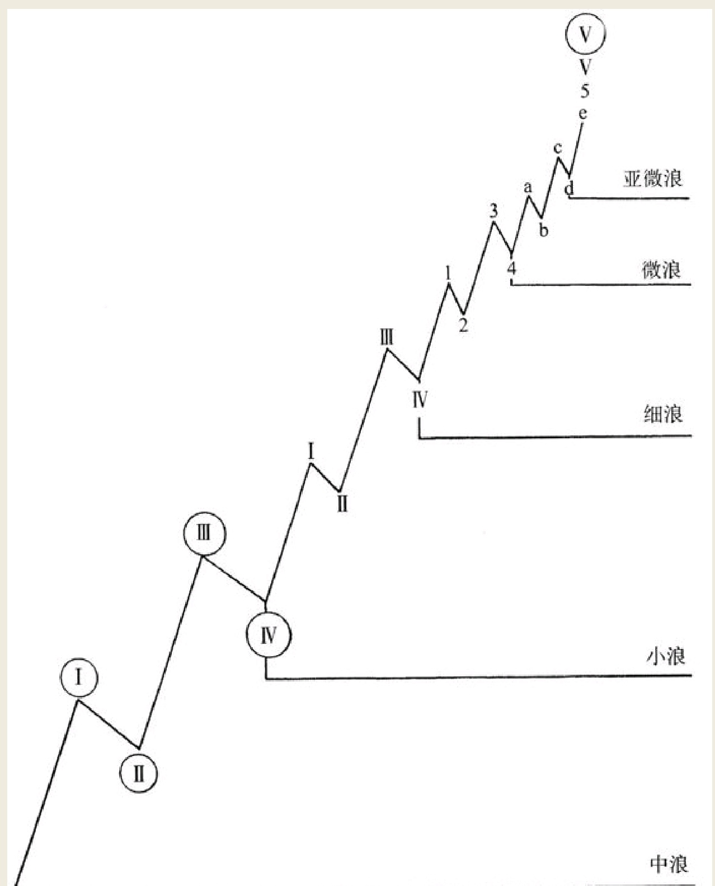
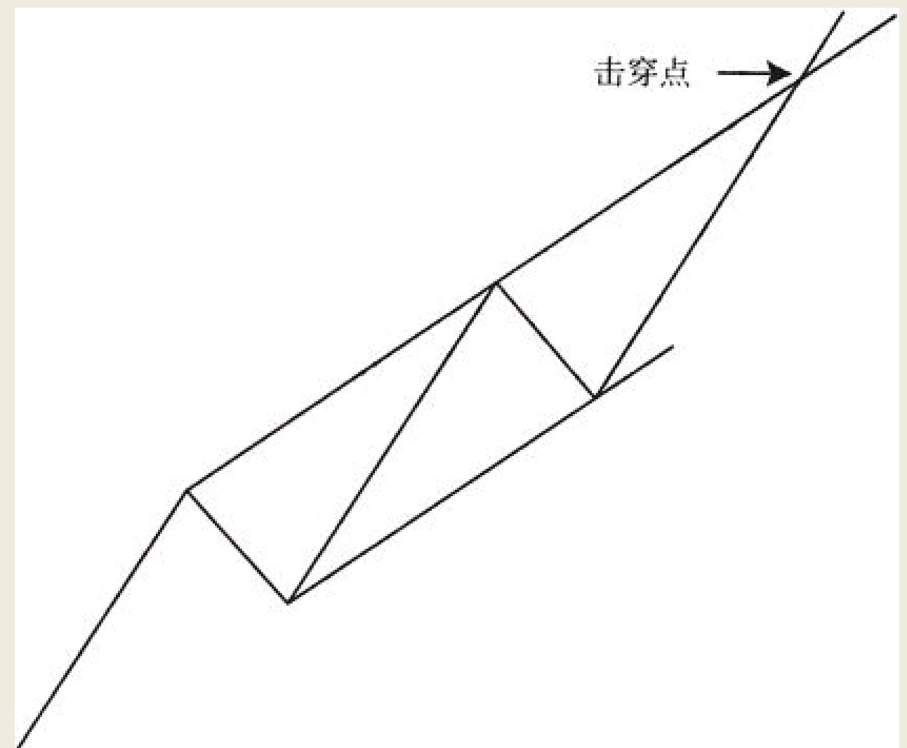
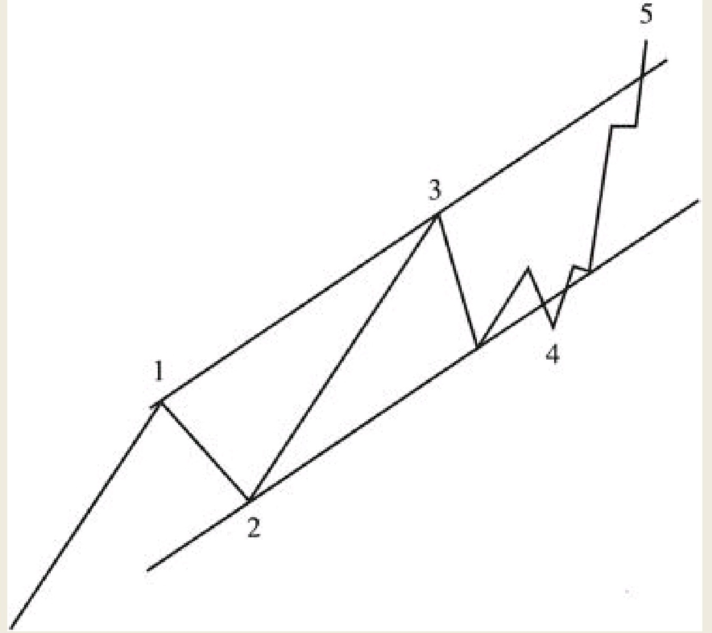

股票市场的投资者和投机者都特别关注第五浪何时走完，因为这是一个最关键的节点。
```
在此之后，市场会朝着相反方向展开类似级别的调整运动。就股票价格运动的时间维度而言，无论是运行数月的中浪、还是运行数年的大浪，都会在它的终点位置展开相当规模的反向调整。而一轮波浪走到终点，意味着我们要将手中的股票平仓。以此类推，识别出一轮调整在何时走完至关重要。理由是：就在这个节骨眼上，意味着建立股票多头头寸的机会已经到来。在本章以下内容之中，我们将对第五浪以及调整浪进行详细论述。与波浪终点相关的其他因素也一并在此章论及。
```
## 第五浪
一轮运动结束之前，市场必须走完它次一级的五个浪。那么以此类推，这种次一级的波浪，也将由更次一级的五个浪所构成。

例如，亚微浪的第五浪结束标志着微浪第五浪的结束，从而标志着细浪第五浪的结束，并同时代表着小浪第五浪的结束，进而宣告了中浪运动的结束。在图16中可以看出，这个第五小浪已经细分成它的第五微浪，而这个第五微浪已被细分成它的五个亚微浪，如图


```
一轮波浪运动的第五浪，尤其是像中浪或者更高级别波浪的第五浪，一般会击穿市场的上通道线。这个上通道线在本书前文（即本书第三章）详细论述过，它是将第二浪，第三浪和第四浪的终点相连接绘制而成的两条平行直线。具体如图
```


交易量通常会在价格击穿上通道线时显著放大。假如击穿通道线行为发生于一轮大浪运动的第五中浪，则此时交易量应当是不同寻常地放大。当任何级别的第五浪，不能击穿其上通道线并且价格出现了回落，这是市场即将走软的重要警告。它所预示的调整幅度，取决于波浪的级别。有时在击穿点附近，第五浪不会很快结束，而且在第五浪启动之前，第四浪已经开始变得平缓。如图


## 调整浪
