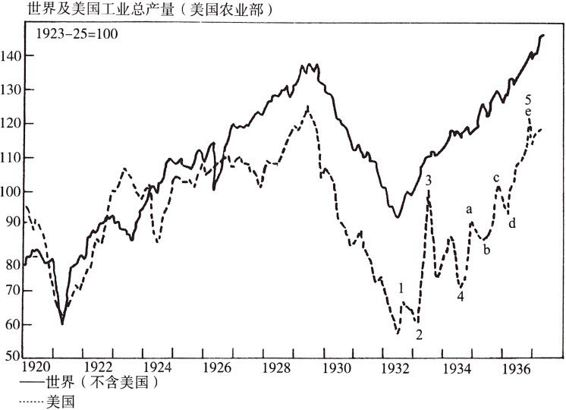
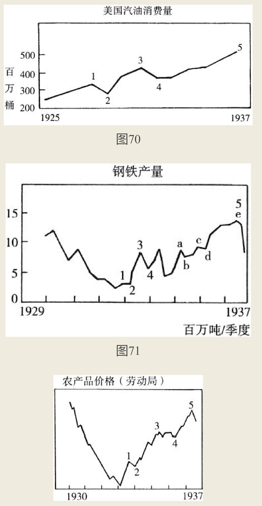

人们对波浪循环这个概念的使用显然过于肤浅。根本原因是，一些颇具误导性的观念已经被深深地根植在人们的头脑和行动中，但波浪循环真正的内在规律却被人们忽略了。

本书选取股票市场作为众多运动之一例，研究了波浪循环的内在规律，论述了一个波浪如何成为另一个更大级别波浪运动的起点；
而这个波浪本身就是更大级别波浪运动之中的一部分，它的次级波浪同样受到相同规律的支配。
这与自然界中每一项研究相同，我们知道事物不可能永远朝着一个方向运行，但是任何事物的运动总会呈现出秩序性。
```
不论是何种事物，潜藏在其运动背后的规律总具有固定性，规律主导着事物发展的方向。本书目的在于，首先向读者介绍波浪规律；继而讲述波浪规律在一些让人们迷惑的领域之中的实际应用。
```

```
如图69到图78所示，我们展示了一些随机挑选的图形，作为波浪理论在其他领域中应用的明显案例。这些案例足以表明，只要有波动现象出现的领域，波浪规律就会发挥作用。我们建议除股票市场之外的其他领域的学者，对这个问题进行深入研究。波浪理论的确有助于使他们的研究工作变得轻松自在。
```


不同事物的波浪运动同时见顶并且筑底概率较低。两个或者几个事物或许会同时见到顶部，但是它们的筑底的时间却千差万别，反之道理相同。

