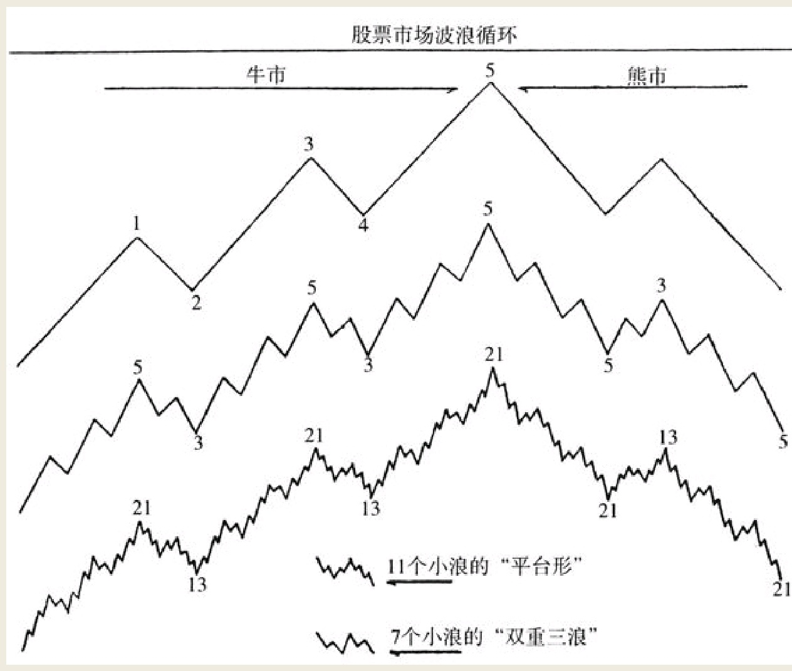
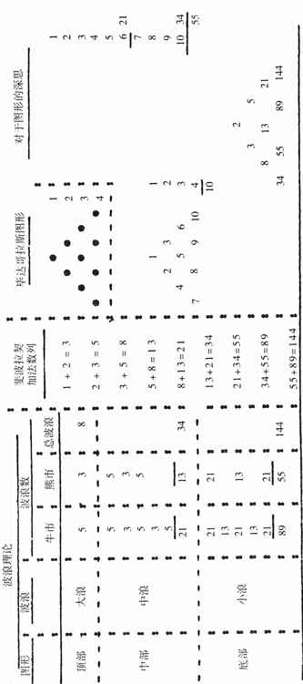

如果追根溯源，挖掘那些波浪循环的成因的话，显然是支配世间万象（包括人类行为的各种情绪波动）的永恒法则在起作用。在长期波浪运行之中，人们对原因的关注显然不如结果重要。
事物背后基础性的永恒法则，绝不会被任何法令所打乱或打断。时事新闻与政治动向对市场只有短暂性的影响力，很快就会被人们所遗忘；它们对于市场趋势的潜在影响，或许并不一定像大众所预期的那样异常显著。
支配万物变动的自然规律是不可逆转的，它影响着季节轮回、潮起潮落乃至斗转星移。实际上我们可以这样说，世界上唯一永恒不变的东西就是变化。作为一种自然法则，它当之无愧地支配着所有领域的人类活动，甚至生物科学那样相对静态的科学领域也不例外。从时间和数学角度看，自然规律也经得起历史检验，从一分钟到十年、再到一百年甚至是一千年都不例外。对波浪运动的足迹本身进行剖析，不要执著于对原因的纠缠，你会练就一套感知变化的技术，进而获得丰厚的投资回报。

到了1934年时，我学会将股市波浪运动细分成为若干单独的小趋势，那些小趋势富有规律地构成一组波浪，我称之为一轮波浪循环。一轮波浪循环总是在市场上重复出现，它不光出现在不同的股票交易记录中，还出现在大宗商品市场、工业生产、气温、音乐、颜色的变化、发电量、流入和流出城市的人口迁徙等等。事实上，它是如此放之四海而皆准，以至于对人类行为和自然界本身均具有约束力，我给这一发现取了个名字叫做波浪理论。
波浪数目、波动幅度和持续时间通常符合一定的数学规律。随着时间的推移，波浪的数目除了浪级改变之外几乎不会发生改变。波浪的长度可能会受到消息等基本面因素的影响，但是波浪的数目却不会因为那些暂时性因素的影响而改变。

## 波浪理论原理及其与数学定理的关系
波浪理论的基础是斐波拉契加法数列。该数列之中的数字包括
```
1，2，3，5，8，13，21，34，55，89，144，等等。
在此数列之中，任意两个相邻数字之和等于下一个更大的数字。比方说：3＋5＝8。任何波浪的浪数，均符合该数列。
在此数列之中，任意一个数字大约是下一个更大数字的61.8％。一段波浪与其下一段波浪的波长之比大致也是0.618。
```

如图1所示，它展示了股票市场一轮波浪循环的三组图。图中显示了牛市及其发展的过程，同时显示了熊市及其逆转过程。图中一轮波浪循环的浪数，与数个世纪以前毕达哥拉斯与斐波拉契总结的数学规律相当契合。


最上面的那幅图中，展示了一轮完整波浪循环的基本浪，或者称之为最大浪。图中牛市阶段有五个浪，熊市阶段有三个浪。
```
在中间的那幅图中，将基本浪进行了放大并且细分，目的是要剖析它们的子浪情况。图中一共有34个子浪。请读者注意，本图与前图之中的“五三”结构保持不变。这幅图向你展示了一轮波浪循环之中的中浪的运动情况。

第三幅图是对同样的那一轮波浪循环中的八大基本浪，或者称为对34个中浪进行的细分。该图包括牛市阶段的89个小浪，以及熊市阶段的55个小浪，一共有144个小浪。该图再一次证明，市场的“五三”结构依然没有改变。到了小浪这一级别，调整浪的规律往往会略微地发生一些变异，有时会出现数字7或者11。根据小浪出现的这些形态及种类的变异，或许能让我们提前感知到市场将要发生什么事。
```
## 斐波拉契
斐波拉契显然是从著名的毕达哥拉斯金字塔图形中得到灵感，推导出了加法数列。该金字塔图由十个数字构成，以一层1个数字开始，以四层4个数字结束。毕达哥拉斯曾经说过，这个金字塔图形蕴藏着宇宙万物之奥秘。这幅图不仅暗合着四季轮回，而且能够用于著名的十年波浪循环子浪的分析。我们在图2之中展示波浪理论、斐波拉契加法数列以及毕达哥拉斯金字塔图形的相通之处。


## 波浪持续时间或称为时间要素
不同浪级的波浪及其子浪的数目，与斐波拉契动态对称加法数列的数字不谋而合。我们在此重温一下该数列：1，2，3，5，8，13，21，34，55，89，144，等等。
基于这一数列的波浪理论，在辨认和测算每一个波浪，以及预测每一个波浪的波动幅度时非常管用。同时，它们对于估计不同时间周期（包括日、周、月或年）的波浪持续时间方面也具有重要价值。然而，波浪持续时间作为一个独立的问题，当把既定的数列关系套用在具体波浪持续时间的估计上时，我们也许会碰到许许多多的困惑。

在研究波浪持续时间时读者应当谨记，对于一轮波浪循环开始和结束的时间而言，月初、月中或者月末均有可能。正是由于这一原因，当我们使用与月份数列等值的天数或周数来预测波浪持续时间时，可能会与波浪走过的实际月份时间存在一定的出入。


