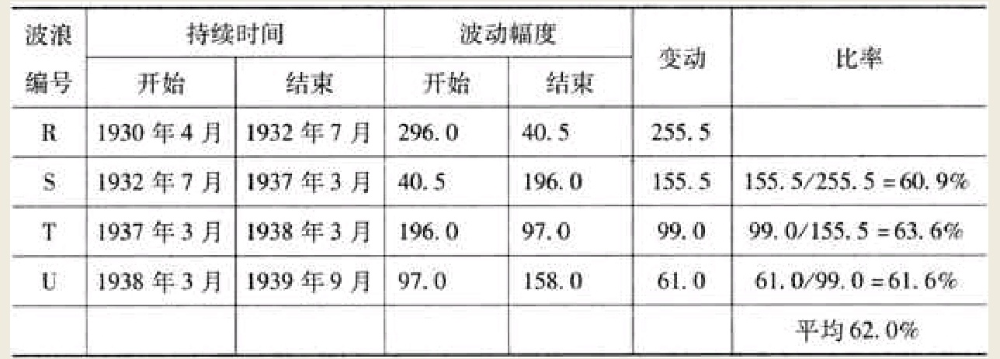

追溯这种市场低迷的起因，不外乎是波浪循环运动带来的影响，并且我们能够用量化的方法对之加以探讨。
随着股票价格波浪的运行，投资者的市场行为也随之扩张或收缩。价格趋势的波动越长，公众投资者的持仓兴趣和股票交易量也随之放大，反之亦然。就在最近几年之中，价格趋势的波动已经渐趋地收缩，市场正呈现出人们所公认的三角形的典型特征。

```
如图5所示，从道琼斯工业股平均价格指数的月波动图上可以清晰地看出，市场是多么的缺乏信心，以及由此所导致的交投低迷。图中那两条虚线，Q－V（即连接1930年4月、1937年3月以及1939年9月依次下降的顶点而成）和R－V（即连接1932年7月和1938年3月依次上升的顶点而成）形成了一个巨大的三角形形态。在这个三角形之中，无论是波浪的波动幅度还是持续时间，每一次摆动都按照0.618的数学比率逐渐地收缩。
```


这个三角形从轮廓分析，也可以称得上是一个“比率三角形”。然而它与我在《波浪理论》一文中所描绘的“三角形”调整浪在某些重要方面差异明显。0.168这个数学比率以及它的倒数1.618，起源于圆的周长与它的直径的比率或3.1416这个数字。这一比率同时也是斐波拉契加法数列的内在特征，它在数学结果上和波浪理论的思路完全一致。这种相似性在我的论文《波浪理论的基础》之中进行过全面论述。斐波拉契加法数列中，每个数字与下一数字之比及其倒数值，如下表所示。


这些数列及其比率，一直在控制着市场运行的波动幅度，制约着市场运行的持续时间，而它们对传统上人们所普遍接受的诸如战争、政治、生产总值、货币供给量、总购买力等决定股票价值的东西置若罔闻。这个结论的正确性，将会被接下来这张1930年4月以来市场重要波动的表格所证实。

波浪循环的相对波动表
表中特征证实，时事和政治对市场波浪循环没有影响。


既然这段别开生面的市场表现的成因，是囊括在三角形区域内的子浪之间的关联性，那么我们可以这样认为，当市场运行到快要接近三角形顶点附近的时候，应当预示着在未来相当长的一段时期之内，市场上的做多行为将会变得蓬勃起来。
借助于波浪理论，我们运用的五种测算与评估市场的方法（波浪循环趋势比率、波浪运动的相对持续时间、波浪的波动幅度、三角形的数学特性以及缘起于宇宙万象的斐波拉契加法数列）都表明：持续了13年之久的这个特别巨大的三角形调整浪，即将面临寿终正寝。