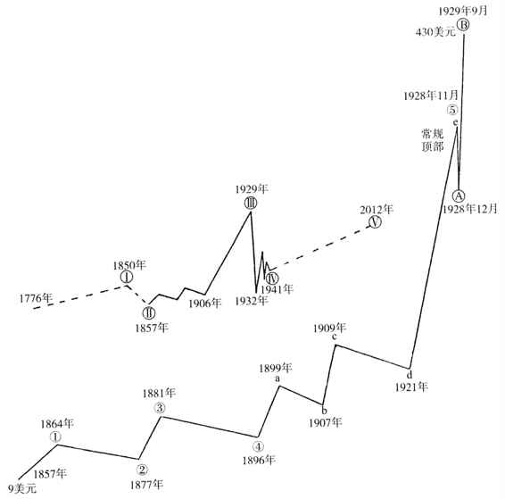

1776～1857年（81年）

下面的图例展示了该价格指数从1857年到1929年9月的长期运动情况。从1857年到1929年的市场运动，极有可能是循环浪的浪Ⅰ、浪Ⅲ、甚至是浪V，这取决于美国股市在1854年之前波浪的性质与幅度。即便如此，我们仍然认为1857年到1929年这1857～1941年（84年）段波浪应当被视作浪Ⅲ。
原因在于：首先，这段长达80年之久的美国历史前后经历了美国革命、内战以及已经在进行中的第二次世界大战。其次，1929年以来的市场已经呈现出一个巨大的持续13年之久的三角形形态，它的波动幅度如此之大，以至于这些萎靡失败的年度很可能已经构成了整个波浪循环的浪Ⅳ。另外，根据我的长期观察，标准的三角形形态通常担当着一轮波浪循环的第四浪。

为了更好地解释那个三角形被视作浪Ⅳ的原因，我们有必要首先回顾一下数年之前的市场状况，尤其是1921年至1929年那一段强劲有力的波浪运动。因此，我们把注意力集中在子浪的第五浪上面。正如埃克斯－霍顿指数图中显示的那样，整个子浪从1906年运行至1929年。子浪的第五浪也可以被称为e浪，它从1921年开始启动，一直运行到1928年11月的延长浪昭示市场顶部，它才宣告结束。在这篇论文之中，我们对它进行了进一步细分。关于这种波浪形态，我在论文中称它为“半月形”。这种波浪形态强悍无比，伴随着它的是极高的运动速度、极大的交易量以及极其疯狂的投机氛围。更重要的是，它正是始于1857年的长期波浪循环的高潮阶段。

就像1857年至1929年这样的波浪循环，其中还涵盖从1921年至1929年的市场疯狂，无论是从价值评估的立场来看，还是从波浪运动的幅度和持续时间来看，大级别的调整浪都在所难免。市场朝着一个方向的高速运动，总是会酿成反方向上几乎相似的高速调整。波浪运动的内在能量，将延续性地传递给后续的调整运动。以此类推，波动幅度、持续时间以及交易量特征，在一轮又一轮的市场波浪循环中相互呼应、相辅相成。综上所述，我们对于1857年至1929年这轮运动必然发生的大级别调整浪的估计是，波动幅度会越来越短，而且前进速度和交易量会逐渐减少。大自然亘古不变的法则，使得波浪与波浪之间0.618的比率不断地在市场重演。自从1928年以来（我们甚至还可以说是从1930年4月以来）的整个市场波动，形成了一个规模巨大的三角形形态。这个巨型三角形形态，可以被视作是追溯到1776年开始启动的一轮波浪循环的浪Ⅳ。

三角形形态之中的浪⑤进展顺利，它的终点落在三角形区域之内或者之外，已经不重要。重要的是该终点的到来，必将标志着悲观主义硝烟笼罩市场的13年三角形调整浪的结束。这个终点还会标志着，一轮新的波浪V开始启动。它将由一系列级别较小的波浪循环构成，它在诸多方面的特征，均有可能与1857年至1929年那段长期波浪循环如出一辙。波浪V预计在2012年之前不会结束。（参见图6之中的虚线）。

图6

