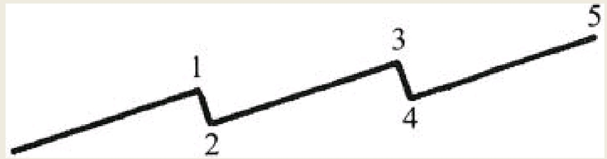
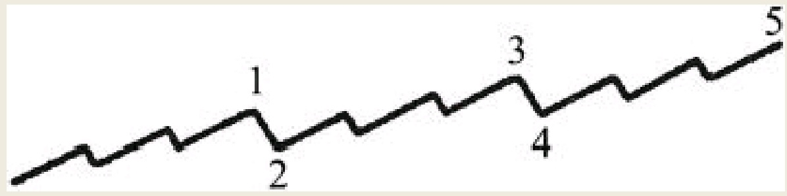

有史以来宇宙万物总是呈现出有规律性的波动，这是不变的法则。人们不断从研究这个法则及其表现形式之中获得知识与力量。这个法则的影响力在潮汐、天体、旋风、昼夜、甚至是生命周期之中均可找到。我们将事物这种富有节奏的规律性波动称为波浪循环。
```
许多伟大的科学家也对此进行了研究：哈雷的彗星、贝尔的声波、爱迪生的电波、马可尼的无线电波、一些科学家提出的心理波、宇宙电波以及电磁波等。
所有这些的共同点是，事物都以波浪的形式存在，它们不断重复自身运动并呈现循环状态。这种波浪运动由两种力量起作用——一个向上推高而另一个向下摧毁。就像人们解释恒星运动规律那样，据说希特勒的征服时机选择就符合这种自然法则——一种向下摧毁的力量逐渐聚集，并且在合适的时机会成为人心的主宰力量，这种力量完成了历史的一轮循环。
```
事物会再现或者重演的现象，使得我们具体而有效地从其变化之中吸取经验教训成为了可能。交易波动以及股票市场中的熊市、牛市交替也受同样的自然法则所支配。

大约是在五十年之前，查尔斯·道对股票市场一些重要运动轨迹的深入观察，逐渐建立了现在被广泛接受的道氏理论，该理论具有特殊的预测价值。从此以后，关于市场交易信息的记录和分析逐渐增多了起来。

本人逐渐将那貌似狂乱的、看起来毫无表情的、显然无法控制的价格波动，与大海波浪的翻滚模式联系起来。有了这种规律（我称之为波浪理论）作为计量依据，预测及把握一轮大循环（小浪，中浪，大浪甚至更大级别的波浪）的发展运动和调整变得简单轻松。

一轮波浪循环的运动轨迹通常由五个驱动浪构成：三个向上运动，两个向下运动。
驱动浪的浪1、浪3和浪5位于主要趋势的方向上。
浪2对浪1构成了调整，浪4对浪3构成了调整。通常情况下，三个向上的波浪几乎是在一个平行的平面里运动；浪2和浪4这两个调整浪也是以相似的方式运行。


![[1.jpg]]

共同构成一轮完整大浪循环的三个驱动浪，每一个浪又可以被细分为次一级或者被称为中浪的五个子浪。
具体细分情况如图2所示。通过仔细观察我们发现，五个次一级的中浪构成了大浪的驱动浪1、驱动浪3和驱动浪5，以此类推，大浪2对大浪1构成调整，随后的大浪4对由五个中浪所组成的驱动浪3形成了调整。



![[2 1.jpg]]


如图3所示，每一个向上的中浪又被细分为五个小浪。当第五个大浪的第五个中浪的第五个小浪寿终正寝时，可怕的顶部就近在眼前。在这一级别的波浪走完时，向下摧毁性的力量成为市场主导，大浪的趋势掉头向下，熊市正向人们走来。往往直到熊市已经启动很长时间之后，导致熊市的经济、政治或财务诱因，或许才会最终浮出水面。
![[3.jpg]]