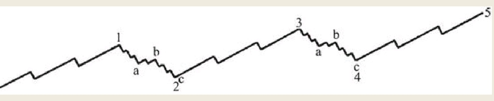

相同级别的五个浪构成另一个更高级别波浪的第一浪。当所有级别波浪的第五浪均走完时，在该轮市场之中就会出现一个比之前任何调整都剧烈的调整浪。
## 完整的波浪
市场调整运动的波浪规律，与主要趋势上的情况截然不同。波浪的这些调整运动，或者称之为浪2和浪4，每一个均由更小级别的三浪构成，但是驱动浪（浪1、浪3和浪5）每一个都由更小级别的五浪构成。

如图4所示，展示了一轮完整的波浪运动。该图与图3道理相同，只是浪2和浪4锯齿形的调整展示得更加具体。
图中的浪2和浪4都包含三个子浪，这两个调整浪本身也自成完整的波浪循环，因此它们自身也具备五浪驱动的特征。

这也就是说，调整浪中的第一个阶段a和第三个阶段c，分别都由更小级别的五个子浪构成；

而调整浪中的调整阶段b，由三个更小级别的子浪构成。调整浪的一些形态和种类，在结构上显得相当复杂，以至于在这个阶段的市场，往往会使投资者感到一头雾水。

## 使用的价格区间
不能把我们的眼光局限在每日或每周的收盘价上。恰恰是最高价与最低价及其波动范围，对随后波浪运动方向产生着重要引导作用。

因此，对于一轮完整波浪长度的预测，应当把握住它在同一浪级或者更大浪级之间的调整运动是否走完。
最小级别的波浪的长度，是朝着一个方向运行的、没有发生过任何级别调整的一段运动，即便是在小时波动图之中也是如此。
假如小时波浪图之中出现两个调整浪，意味着这段市场运动已经走到了它的第五个浪也就是最后一个阶段，或者是到了高一级别波浪的第三个驱动浪。通常所谓的阻力线及其他技术工具，对于预测波浪的长度以及持续时间方面其价值微乎其微。

