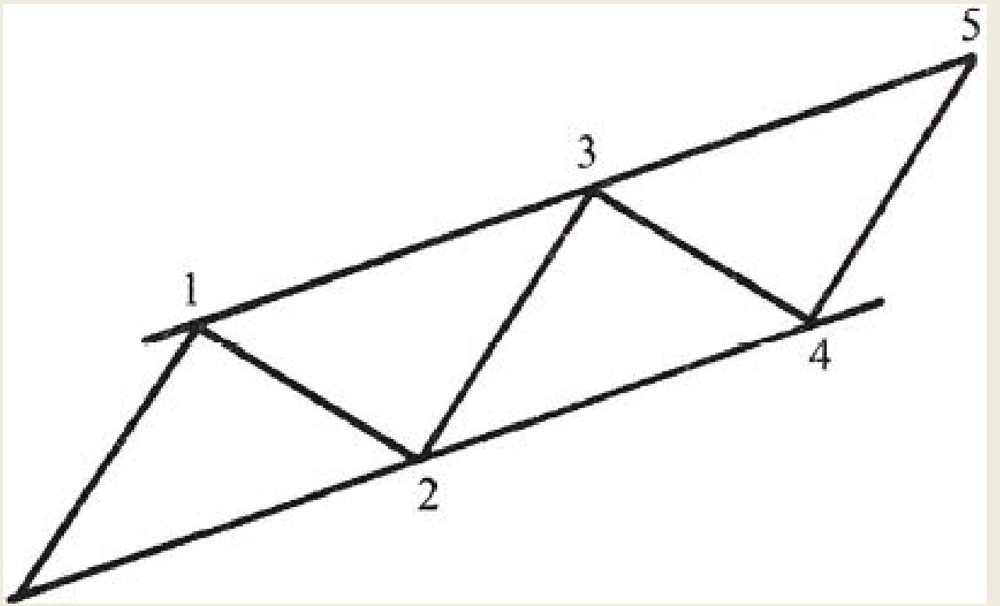
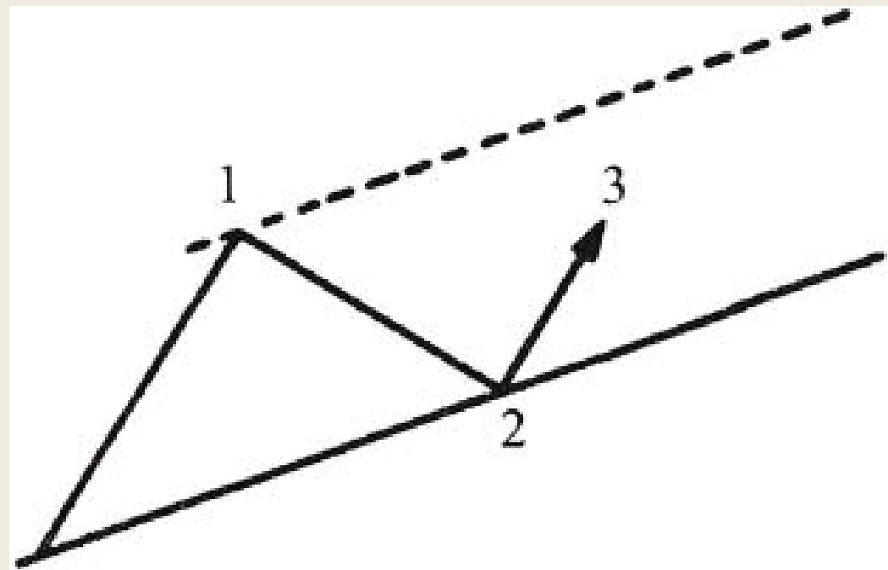
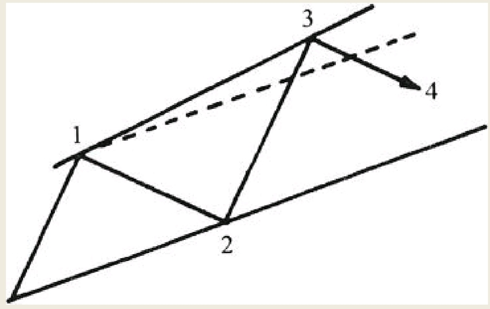
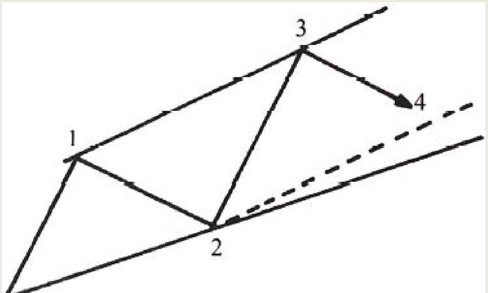
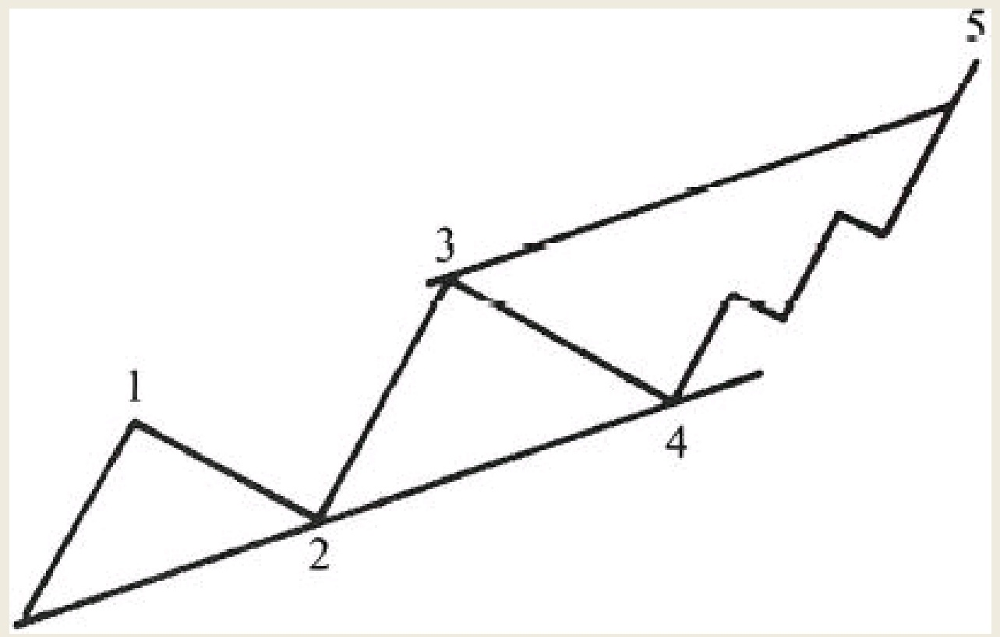

一轮上升波浪运动的第五浪走完时，市场面临的调整压力将比该轮波浪运动中的任何一个浪都大。此时的关键在于，设法预先定位该波浪循环的顶部位于何处。
```
前文已经论述过，对于一轮完整波浪运动的长度，应当把握住它在同一浪级或者更大浪级之间的调整运动是否走完。利用本文所定义的通道原理，在这些波浪的运行过程中反复测量他们的长度，就有可能在浪4走完的时候大致估算出第5浪的顶点。
```
如图6所示，该图展示了一轮完整市场运动，或者我们称之为波浪循环。它的浪1、浪3和浪5，每一个看起来都拥有大致相同的长度。
根据我们所说的通道原理，要想预测波浪运行的顶点位置，必须得等到浪1和浪2走完。
此时才可以从浪1的起点，穿过浪2的终点画出一条直线作为下一阶段市场运行的基线。

如图7所示，穿过浪1的终点绘制一条平行于基线的直线并向上延长会得到一条上通道线。通常而言，浪3应当在那条暂时性上通道线附近走完（如图中虚线所示，之所以称之为暂时性上通道线，是因为随着浪3的走完可能会得到一条新的上通道线）。


如图7所示，穿过浪1的终点绘制一条平行于基线的直线并向上延长会得到一条上通道线。通常而言，浪3应当在那条暂时性上通道线附近走完（如图中虚线所示，之所以称之为暂时性上通道线，是因为随着浪3的走完可能会得到一条新的上通道线）。


暂时性上通道线从浪1的顶部穿过并向上延长，平行于底部那条基线。但是，有时市场氛围可能会变得异常乐观，使得浪3变得具有异乎寻常的瞬间力量，那种力量超过了人们的正常预期，如图8所示


等到浪3走完时，连接浪1的顶部与浪3的顶部，我们可以得到一条实际上通道线。更进一步，为了预测浪4的反作用力调整浪会在哪个位置结束，我们有必要从浪2走完的点出发，画出一条平行于实际上通道线的直线并向上延长。正如图9的虚线所示，图中给出了我们从理论上估算的浪4终点，以及浪4实际走出的终点。


当第二次反向运动的调整浪——浪4走完时，我们就可以绘制出最终通道，这算得上是最重要的通道线了。连接两个反向运动调整浪的（浪2和浪4）顶点，得到最终通道的基线。穿过浪3的末端，绘制一条平行于该基线的直线并向上延长。此时，浪1基本上可以被忽略，除非浪3驱动力出乎意料的强劲。正如前文所述，一旦绘制了基线和上通道线，第5浪结束的大致位置就可以估算出来，如图10所示。


```
这种通道原理固然重要，但是剖析构成一轮完整波浪运动各个阶段的规律更加意义深远。浪1、浪3和浪5，它们通常每一个都由五个更低级别的波浪所构成。从理论上讲，浪5应在与前文所讲的上通线相交之时结束。然而，有时市场中的第五浪进攻得异常强势，这种情况下会出现击穿通道线的现象，这将在本文后续的部分中进行详细论述。
```

