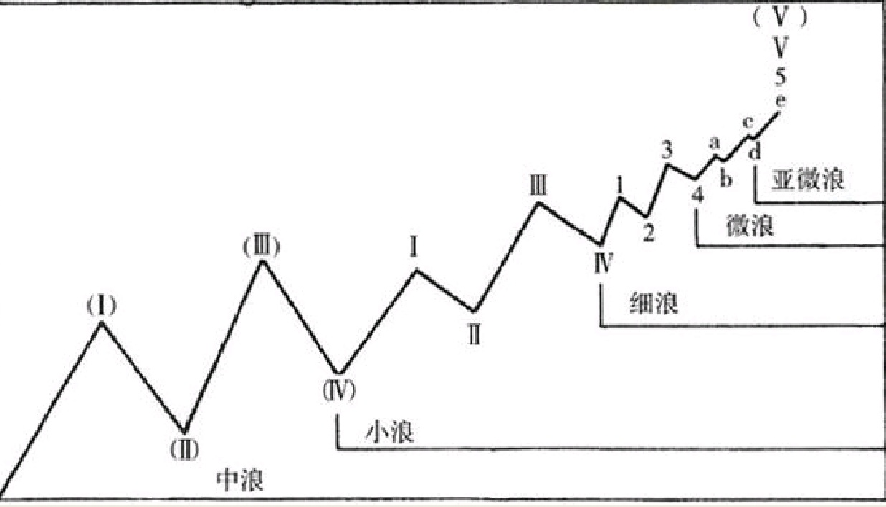

## 第五浪细分的各个波浪形态
市场第五浪是如何细分为五个更小级别的子浪，并且推动波浪延长的。因此，一轮中浪级别运动的结束，以中浪第五驱动浪中的第五小浪中的第五细浪之中的第五个亚微浪的结束为标志。注意图中在浪（Ⅴ）上攻的过程中，那些调整浪变得越来越小，而且它们持续的时间越来越短。对照一下1935年到1937年的市场，一个五浪结束的终点位置，恰恰是相同级别的调整浪要启动的标志性位置。

有时，市场会出现击穿通道线的现象，这可能使得人们在识别第五浪之中的较小级别波浪时会心生疑惑。
所谓击穿通道线，是指波浪在上升运动中翻越上通道线以及在下跌运动中跌破下通道线的现象。
击穿现象发生时，交易量往往会明显放大。如果击穿现象出现在大浪运动的第五浪，此时市场通常放出异常巨大的交易量。
倘若任何级别的第五浪，均未能击穿通道线并且后续伴随着持续下跌，则是市场即将走软的重要警告。
市场杀跌程度，要取决于波浪的级别。有时这样的走软，也会为第五浪重拾升势奠定基础。击穿现象还有可能是波浪图绘制时的刻度因素引起的。击穿通常更有可能出现在算术刻度的上升运动中，以及对数刻度中的下降运动中。

## 延长线
有时，市场会出现第五浪延长的现象——即扩张或拉长——我们称之为延长浪。第五浪延长并不是以整个运动相同级别的波浪一浪走完，而通常是简单延展或扩张成五个更小级别的子浪。在波浪规律分析时，这样的延长浪应当从属于第五浪本身，而不是单独作为整体市场循环的一部分。延长浪的出现，通常是市场异常强劲（如果是向下运动则是异常疲软）特征的重要表现。

