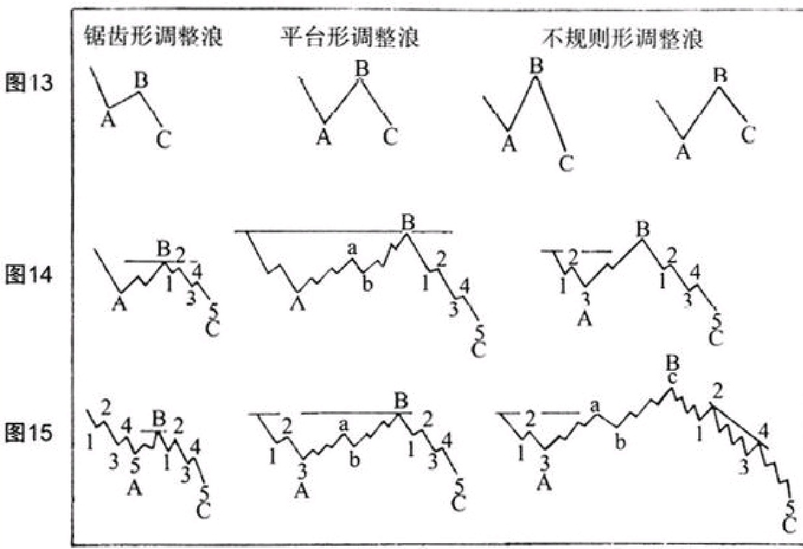

通过识别那些正在前进中的调整浪的类型，研究者就获得了预测调整浪及其后续市场波动幅度的信号。通道法有助于估算其波动幅度。本文后续会讨论这些形态在特定市场中的应用。

几乎所有调整浪都以三个代表性的波浪为特征，但它们的细节和幅度变化很大，故而在实践之中会形成各式各样的调整浪形态。
各种因素（比如时间、速度、之前波浪运动幅度、交易量、基本面信息等）都可能会影响并决定调整浪的具体形态。
我们分别定义为
- 锯齿形的调整浪
- 平台形的调整浪
- 不规则形的调整浪
- 三角形的调整浪
我们会在本文其他部分单独讨论各种三角形的调整浪。我们把其余三种调整浪形态分别绘制在图13、图14和图15文中。


```
图13展示了在相对较短时间走完的小调整浪；图小妙14描述了更大级别运动的调整浪；
图15则展示了大浪及中浪级别的市场调整行为及其特征。有些调整浪——尤其是一些不规则形态的调整浪，也许会延续数年之久，此中波浪甚至通常会被错误地认为是牛市运动。

锯齿形的调整浪的第一浪和第三浪（A和C）都由五个较小的子浪构成，第二浪（B）由三个子浪构成。有时在高速运动的波浪之中，第一浪（A）也许会持续得很久，此时或许有必要借助于更小浪级或进行小时运动研究以挖掘波浪规律。

平台形和不规则形的调整浪，其第一浪、第二浪都由三个比之前运动小一级别的子浪构成。在平台形和不规则形调整浪的第二个阶段，或称B阶段的三个波浪运动中，第一浪和第三浪（a和c）都分别由五个更小的驱动浪构成。在一个平台形的调整浪中，三段波浪近乎等长。

不规则形调整浪与其他类型调整浪区分开来的技巧是，它的第二浪或称之为B浪，会进攻到比大浪级运动所走出的常规顶部更高。因此与第一浪相比起来，第三浪或称之为浪C中的下跌会更有力度。通常浪C会运动到浪A以下更低的位置，尽管有时市场上浪C偶尔也会出现缩短的情形。在一些级别更高的重要调整浪中，比如说大浪级和中浪级的调整浪中，不规则形调整浪的第三浪或称C浪也许会由三个更小级别的五浪所构成。具体如图15所示。
```
