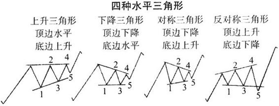
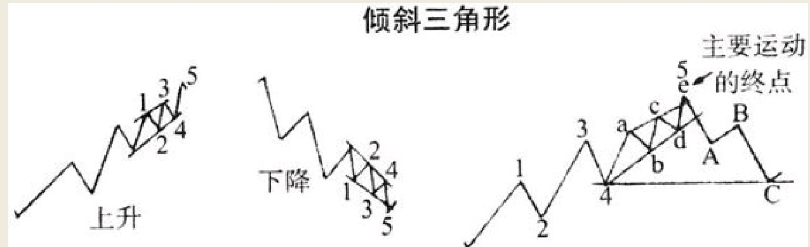
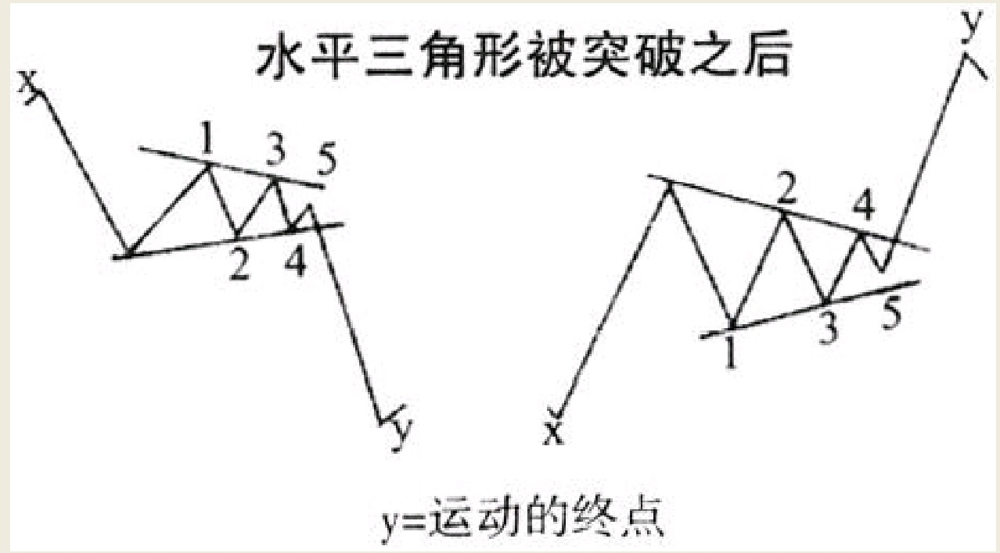

三角形的调整浪，属于一段伸展开来的犹豫徘徊的市场走势。市场的步伐也许走得太快太远了，它开始走起了小碎步，直到潜在的市场力量再次卷土重来。三角形调整浪有时运行长达九个月之久，有时也在短短七个小时之中结束。三角形调整浪有两种类型：水平三角形和倾斜三角形。具体如图16和图17所示。

水平三角形通常包括四种：上升三角形、下降三角形、对称三角形以及在市场上相当鲜见的反对称三角形。反对称三角形的顶点是三角形调整浪的开始，而其他几种三角形的顶点则是调整浪的终点。但是那些三角形调整浪也有可能在它实际到达顶点之前走完。

所有的三角形调整浪，均包括五个浪或者称之为五条腿，而其中每一浪均由不超过三个的较小级别波浪构成。不符合这一定义的调整浪则被排除在波浪理论之外。三角形中所有浪隶属于一个较大的同向运动之中的一部分，否则这个三角形的出现不过是一个巧合。

整个三角形本身构成了市场主要运动的一个浪。水平三角形通常作为浪2或者浪4出现。如果是作为浪2出现，那意味着市场主要运动只有三个浪。在一个水平三角形的终点位置，市场将重新恢复被三角形打断的那个主要运动趋势，而且下一步市场运动的方向，将与该三角形中的浪2方向相同。从水平三角形终点位置开始的突破行为，将沿三角形中的浪2方向前进，其启动往往较为迅速，它代表市场主要运动的最后一浪，在它之后的市场通常展开一轮反转。至于上述突破行为的波动幅度，通常与三角形最宽阔部分之间的距离大致相同。正如图18所示，我们展示了从水平三角形终点开始的突破行为及其波动幅度。

倾斜三角形向上或向下倾斜均有可能。它们可以作为市场主要运动的浪3或者浪5出现，而通常情况下，它们是作为浪5出现在四个主要波浪之后。倾斜三角形的走完，同时意味市场主要运动的结束。在倾斜三角形之中，第二浪的方向将会和市场主要运动方向相反，而且它会指明三角形结束之后市场反转的方向。在倾斜三角形的第5浪结束之时，趋势往往快速反转，通常把价格拉回该三角形刚刚启动时的价位。具体情况如图17中所示。

三角形调整浪并不是在所有的研究之中均随处可见。有时它们在周波动图中出现，却在日波动图中找不到它们的影子。有时候它们出现在比如说纽约时报指数中，而同时在其他指数中并未出现。因此对于1937年10月到1938年2月之间那段波浪运动，在标准统计指数的周波动图中形成了一个三角形，形态规模庞大且至关重要，但它在其他平均价格指数中并没有出现。那个三角形的浪2方向是向下，第5浪在1938年2月23日走完，将市场推高到了极致，而紧随其后的是3月份市场对三角形向下的剧烈突破。

