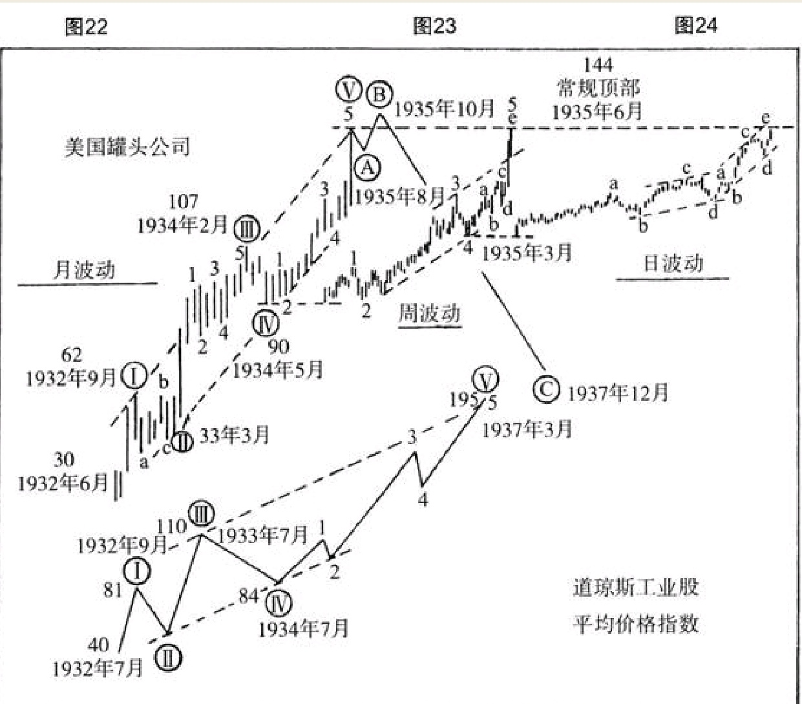

分析的时间周期越长，波浪的形态就会越完美。

运用波浪理论对美国罐头公司的分析。
1932年6月牛市开始启动，1935年6月出现了常规的市场顶部。
一直到1937年12月一轮波浪循环最终结束，我们已经在图中画出了趋势线。
在这样的月波动图上，如果把周波动和日间波动情况均浓缩进来，呈现出五个明显的大浪。
那些相对较长周期的波浪运动图，能够实质性地帮助投资者增强市场洞察力。

这一轮波浪循环的第五大浪，在1934年5月启动。换句话说，也就是大浪 的反作用浪走完时，要更加细致地分析此时的市场。
图23应运而生，该图展示了第五大浪的周波动情况。当这个大浪的中浪四走完之后，关注日间波动图就变得相当关键。
如图24所示，第五中浪从1935年3月启动，第五小浪在1935年6月走完。美国罐头公司的股票价格上攻到144美元附近时，市场呈现出该轮牛市的常规顶部已经到来的迹象。

就在美国罐头公司股票牛市波浪出现常规顶部之后，市场在1935年8月走出了回调性的浪A，将价格再次拉回到136至137美元附近。接着，股价走出了一段反弹行情B，市场在1935年10月份反弹至149至150美元附近。这是一个不规则顶部，但它却是本轮市场运动的实际最高峰。正是从这个位置开始，市场用五个中浪走出了漫长的调整浪C，并最终在1937年12月将股价拉回到69美元。

当美国罐头公司的牛市波浪运动走出常规顶部时，投资者应当注意到，该股票的波浪运动，与整体市场的走势具有天壤之别。
如图25所示，该图展示道琼斯工业股平均价格指数几个重要大浪的走势。在1935年3月，美国罐头公司的股价正处在牛市波浪运动的尾声阶段，即第五大浪的第五中浪的位置。

而道琼斯工业股平均价格指数为代表的整体市场刚刚启动它的第五大浪，它要走出五个向上的中浪。
在1935年6月的时候，持有美国罐头公司股票的多头们应当意识到，对这只股票的任何看涨预期，都具有高度的不确定性；然而对于道琼斯工业股平均价格指数为代表的整体市场而言，更多利润可以说是唾手可得，同时还伴随着最小的风险。正是从那时候开始，平均价格指数大涨了近80点，足足上涨了65％之多。

