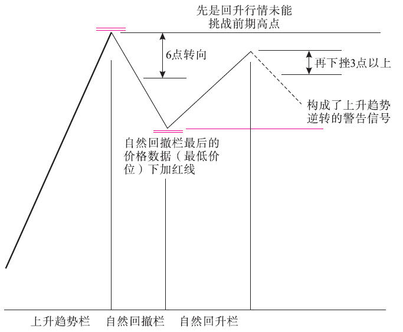

## 规则1，在上升趋势栏记录价格时，用黑墨水。

## 规则2
在下降趋势栏记录价格时，用红墨水。

## 规则3
在其余栏记录价格时，用铅笔（在本书的图中实际是蓝色的，这是印刷的需要）。
## 规则4-1
当你开始在自然回撤栏记录数据时，第一天要同时在上升趋势栏最后一个数据下标两条红线。当市场发生回落行情、且下跌幅度距离上升趋势栏最后一个数字约6点时，开始转换记录栏。
```
之前是在上升趋势栏中记录，上升趋势行情曾不断创新高，所记录的数字也是迭创新高。在上升趋势栏中记录的都是每次创新高的行情数字，其他小波动都被忽略掉了。
按照利弗莫尔的6点转向规则，只有当市场当前价格回落到距离上升趋势栏最后一个数字（亦即当前上升趋势的最高点）6个点以上后，才说明市场开始自然回撤，从此要把行情数据记录到自然回撤栏中。
在上升趋势栏最后一个数据下标两条红线，因为那是上升趋势前期最高点，现在成了市场上方的标志性水平——利弗莫尔所说的关键点之一。
```


## 规则4-2
当你开始在自然回升栏或上升趋势栏记录数据时，第一天要同时在自然回撤栏最后一个数据下标两条红线。当市场发生回升行情且上升幅度距离自然回撤栏最后一个数字约6点时，开始转换记录栏。
```
【译者注释】市场原本处在自然回撤状态，所记录的数字当然都是相继创新低的，其他小波动都被忽略掉了。
一旦市场从自然回撤阶段的最低点起向上回升的幅度达到6点，则判断市场已经脱离了自然回撤状态，进入自然回升状态或者上升趋势恢复。转换记录栏，其实就是识别和标注新到来的行情。
```


之前自然回撤栏最后一个数字，就是自然回撤阶段的最低价，这是利弗莫尔所说的另一个关键点。现在你已经有两个关键点可供观察，根据市场在这两点附近的表现，就能够形成自己的判断，到底原有的趋势确实即将恢复——还是原来的市场运动已经告终。
```
【译者注释】在上升趋势进入调整状态后，先有上升趋势前期最高点，再有调整阶段的最低点，两个关键点共同形成了调整阶段的价格区间。
```
一般地，如果市场向上突破上升趋势前期最高点、重新创新高，则说明调整阶段结束、上升趋势恢复；如果市场向下跌破调整阶段的最低点、创出新低，并且创新低的幅度达到一定数值，则说明市场顶部过程已经完成，原先的上升趋势已经告终。
上图的水平红线标注的就是调整阶段的价格区间。
## 规则4-3
你开始在自然回升栏记录数据时，第一天要同时在下降趋势栏最后一个数据下标两条黑线。当市场发生回升行情且上升幅度距离下降趋势栏最后一个数字约6点时，开始转换记录栏。


【译者注释】之前是在下降趋势栏中记录的，下降趋势行情曾不断创新低，所记录的数字也是迭创新低。在下降趋势栏中记录的都是每次创新低的行情数字，其他小波动都被忽略掉了。
按照利弗莫尔的6点转向规则，仅当市场当前价格回升到距离下降趋势栏最后一个数字（亦即当前下降趋势的最低点）6个点以上后，才说明市场开始自然回升，从此要把行情数据记录到自然回升栏中。在下降趋势栏最后一个数据下标两条黑线，因为那是下降趋势前期最低点，现在成了市场下方的标志性水平——利弗莫尔所说的关键点之一。

## 规则4-4
当你开始在自然回撤栏或下降趋势栏记录数据时，第一天要同时在自然回升栏最后一个数字下标两条黑线。当市场发生回落行情且下降幅度距离自然回升栏最后一个数字约6点时，开始转换记录栏。
【译者注释】市场原本处在自然回升状态，所记录的数字当然都是相继创新高的，其他小波动都被忽略掉了。
一旦市场从自然回升阶段的最高点向下回落的幅度达到6点时，则判断市场已经脱离自然回升状态，进入自然回撤状态或者下降趋势恢复。

之前自然回升栏的最后一个数字就是自然回升阶段的最高点位，这是利弗莫尔所说的另一个关键点。
在下降趋势进入调整状态后，先有下降趋势前期最低点，再有调整阶段的最高点，两个关键点共同形成了调整阶段的价格区间。
一般地，如果市场向下突破下降趋势前期最低点、再创新低，则说明调整阶段结束、下降趋势恢复；如果市场向上突破调整阶段的最高点、创出新高，并且创新高的幅度达到一定水平，则说明市场底部过程已经完成，原先的下降趋势已经告终。上图的水平黑线标注的就是调整阶段的价格区间。

## 规则5
如果正在自然回撤栏记录数字，最新到来的价格比自然回撤栏内用红线标记的最后一个价格低3点或更多，那么该价格就应当用红墨水记入下降趋势栏。

【译者注释】这同样是判断趋势真正逆转的3点突破规则。
在自然回撤栏内用红线标记的最后一个价格就是调整阶段价格区间的最低点，如果后来市场跌破了该水平，且跌破的幅度达到3点或更多，则说明顶部形态已经形成，市场从上升趋势逆转为下降趋势。


## 规则6
如果正在上升趋势栏记录价格，新发生的回落过程达到了大约6点的幅度，则转到自然回撤栏记录这些价格，此后每一天，只要该股票的价格低于自然回撤栏最后记录的价格，就继续在该栏记录。
【译者注释】以下是对前几条规则的补充说明。在上升趋势中，只要市场持续创新高，则判断上升趋势持续；或者，虽然市场未持续创新高，但市场波动的范围距离前期最高点不超过6点，也判断上升趋势持续。仅当市场未持续创新高，且向下波动的范围比前期最高点达到或超过6点后，才判断上升趋势转入自然回撤阶段。在自然回撤阶段，只要市场持续创新低，就继续在本栏记录新低价格。换言之，自然回撤栏中记录的是市场连续下跌的过程。

## 规则6-2
如果正在自然回升栏记录价格，新发生的回落过程达到了大约6点的幅度，则转到自然回撤栏记录这些价格，此后每一天，只要该股票的价格低于自然回撤栏最新记录的价格，就继续在该栏记录数据。如果正在下降趋势栏记录价格，则只要新价格低于下降趋势栏内最后记录的价格，就继续在下降趋势栏记录。
【译者注释】如果市场原本处在自然回升阶段，当价格向下波动的幅度距离前期高点达到了6点时，则判断市场转入自然回撤阶段，之后只要价格持续创新低，则判断自然回撤阶段持续，继续在自然回撤栏记录。
如果市场原本处在下降趋势中，只要价格持续创新低，则判断下降趋势持续，继续在下降趋势栏记录。

## 规则6-3
如果正在下降趋势栏记录数字，新发生的回升过程达到了大约6点的幅度，则转到自然回升栏记录这些价格，此后每一天，只要该股票的价格高于自然回升栏内最后记录的价格，就继续在该栏记录。
【译者注释】这是判断下降趋势是否持续的6点转向规则。在下降趋势中，只要市场持续创新低，则判断下降趋势持续；或者，虽然市场未持续创新低，但市场波动的范围距离前期最低点不超过6点，也判断下降趋势持续。仅当市场未持续创新低，且向上波动的范围比前期最低点达到或超过6点后，才判断下降趋势转入自然回升阶段。
在自然回升阶段，只要市场持续创新高，就继续在本栏记录新高价格。换言之，自然回升栏中记录的是市场连续上涨的过程。

## 规则6-4
如果正在自然回撤栏记录数据，新发生的回升过程达到了大约6点的幅度，则转到自然回升栏记录这些数据，此后每一天，只要该股票的价格高于自然回升栏内最后记录的价格，就继续在该栏记录。如果正在上升趋势栏记录价格，则只要新出现的价格高于上升趋势栏内最后记录的价格，就继续在上升趋势栏记录。
【译者注释】如果市场原本处在自然回撤阶段，当价格向上波动的幅度距离前期低点达到了6点，则判断市场转入自然回升阶段，之后只要价格持续创新高，则判断自然回升阶段持续，继续在自然回升栏记录。
如果市场原本处在上升趋势中，只要价格持续创新高，则判断上升趋势持续，继续在上升趋势栏记录。

## 规则6-5
当你开始在自然回撤栏记录数据时，如果新出现的价格低于下降趋势栏内最后记录的数字，则应当将这个价格用红墨水记录在下降趋势栏。
【译者注释】原本判断市场处在自然回撤状态，但是如果市场持续创新低，跌破了下降趋势栏记录的最低点，则应当调整判断，认为市场处于下降趋势。


## 规则6-6
与上述规则相同，当你开始在自然回升栏记录数据的时候，最新出现的价格高于上升趋势栏内最后记录的价格，则停止在自然回升栏的记录，将这个价格用黑墨水记录在上升趋势栏。

【译者注释】原本判断市场处在自然回升状态，但是市场持续创新高，向上突破了上升趋势栏记录的最高点，则应当调整判断，认为市场处于上升趋势。


## 规则6-7
如果正在自然回撤栏记录数据，一个回升过程幅度达到了距离自然回撤栏内最后记录的数据大约6点——但是，这个价格并没有向上超过自然回升栏内最后记录的价格——就应当将这个价格记录在次级回升栏，此后始终在该栏记录，直到最新成交价格向上超越了自然回升栏内最后记录的数据。当后面这种情况发生时，就应当重新转到自然回升栏记录数据。
【译者注释】当市场处于横向调整过程时，往往会在价格区间范围内上下往返多次。对于横向调整过程中的多次往返也遵循6点转向规则来转换记录栏。


原先市场处于自然回撤阶段，但行情向上波动，距离自然回撤阶段的低点达到了6点，符合6点转向规则，应当转换记录栏。不过，行情并没有向上超越自然回升阶段的高点，不能在自然回升栏中刷新记录，因此将上述行情记录到次级回升栏——判断其属于次级回升行情。
如果次级回升行情达到的高度超越了自然回升栏的高点，则判断行情属于自然回升阶段，回到自然回升栏刷新其最高点记录。不过，根据规则5（a），向上超越的幅度不可以超过3点，否则属于主要趋势逆转。

## 规则6-8
如果正在自然回升栏记录数据，一个回落过程达到了大约6点的幅度，但是回落行情所及的价格并不低于自然回撤栏中最后记录的数字——就应当将这个价格记录到次级回撤栏，此后始终在该栏记录，直到最新成交价低于自然回撤栏内最后记录的价格。当后面这种情况发生时，就应当重新转到自然回撤栏记录数据。

【译者注释】原先市场处于自然回升阶段，但行情向下波动，距离自然回升阶段的高点达到了6点，符合6点转向规则，应当转换记录栏。不过，行情并没有向下跌破自然回撤阶段的低点，不能在自然回撤栏中刷新记录，因此将上述行情记录到次级回撤栏——判断其属于次级回撤行情。

如果次级回撤行情下跌的程度超越了自然回撤栏的低点，则判断行情属于自然回撤阶段，回到自然回撤栏记录。不过，根据规则5（b），向下超越的幅度不可以超过3点，否则属于主要趋势逆转。

## 规则7
同样的原则也适用于记录组合价格——不过这里以12点作为基础，而在单只股票情况下以6点为准。
## 规则8
一旦在自然回升栏或者自然回撤栏开始记录，则下降趋势栏或上升趋势栏中最后记录的价格立即成为关键点。在一段回升行情或回落行情结束后，我们在相反的栏目中重新开始记录数据，此时，先前栏目中记录的极端价格就成为另一个关键点。
正是在上述两个关键点形成后，这些行情记录具有了极大价值，可以帮助你正确预测下一轮重大运动。这些关键点的下方标有两道红色或黑色墨水线，以吸引你的注意力。标注这些线的目的很明确，就是要将这些点始终放在你眼前，无论何时，只要最新成交价格位于在这些点附近，就应当十分谨慎地密切关注市场。你的决策取决于此后的价格记录。

## 规则9-1
当你在下降趋势栏看到用红墨水记录的最后价格下方标注了黑色线时，你也许会在该点附近得到买进信号。【译者注释】在下降趋势持续过程中，间断地发生回升行情，趋势进入调整阶段。在这种情况下，首先，我们要关注下降趋势恢复的信号；其次，要关注下降趋势逆转为上升趋势的信号。
黑线标记的价格是下降趋势的前期低点，向下突破，则下降趋势恢复；不能向下突破，则可能是下降趋势转向的警告信号。后者是作者所说的“也许会在该点附近得到买进信号”。
## 规则9-2
如果在自然回升栏看到某个价格下方标注了黑色线，那么当该股票在下一轮上涨过程中接近了该关键点价位时，正是发现市场到底是否足够坚挺、是否能够明确改变路线进入上升趋势的时机。
【译者注释】黑线标记的价格是下降趋势调整阶段的前期高点，向上突破，则下降趋势逆转为上升趋势。
## 规则9-3
反之亦然。当你在上升趋势栏看到用黑墨水记录的最后价格下方标有红线时，或者当你在自然回撤栏看到最后价格下方标有红线时，同样的道理也适用，只是方向相反。
【译者注释】在上升趋势持续过程中，间断地发生回升行情，趋势进入调整阶段。在这种情况下，首先，我们要关注上升趋势恢复的信号；其次，要关注上升趋势逆转为下降趋势的信号。

## 规则10-1
设计这一整套方法的目的是让我们有能力看清楚，当某只股票首次出现自然回升或自然回撤现象后，其后续动作到底是否属于原趋势状态的应有表现方式。如果原先的市场运动以明确的方式恢复，则不论上升还是下降，市场都会突破先前的关键点——对于单只股票来说，突破的幅度应为3点，在组合价格的情况下，突破的幅度应为6点。
【译者注释】在趋势进入调整阶段后，对行情常规的预期是原趋势恢复，这是规则6（f）的情形。
## 规则10-2
在上升趋势的情况下，如果该股票未能做到这一点，并且在一轮回落行情中，下跌到最新的关键点（记录在下降趋势栏，数字下方标有红线）之下3点或更多，则可能表明该股票的上升趋势已经结束。
【译者注释】如果原趋势未能如常恢复，则焦点转向另一个关键点。请参见规则5（b）。

## 规则10-3
将上述原则应用到下降趋势，如果下降趋势以明确的方式恢复，则在一轮自然回升行情结束后，新价格必须向下伸展到最新的关键点（数字下方标有黑线）之下3点或更多，新价格将记录在下降趋势栏。【译者注释】请参见规则6（e）。
## 规则10-4
如果该股票未能做到这一点，并且在一轮回升行情中，市场上升到最新关键点（记录在下降趋势栏，数字下方标有黑线）之上3点或更多，则可能表明该股票的下降趋势已经结束。
【译者注释】请参见规则5（a）。
## 规则10-5
如果正在自然回升栏记录数据，但当前回升行情在上升趋势栏的最新关键点（其下方标有红线）之下、接近该关键点的价位中止，并且该股票从这一点开始向下回落3点或更多，则构成一个危险信号，表明该股票的上升趋势可能已经终结。
【译者注释】在上升趋势调整阶段，先是回升行情未能挑战前期高点，再下挫3点以上，则可能构成了上升趋势即将逆转的警告信号。


## 规则10-7
如果正在自然回撤栏记录数据，但当前回落行情在下降趋势栏最新关键点（其下方标有黑线）之上、接近该关键点的价位中止，并且该股票从这一点开始向上回升3点或更多，则构成一个危险信号，表明该股票的下降趋势可能已经完结。
【译者注释】在下降趋势调整阶段，先是回落行情未能挑战前期低点，再向上反弹3点以上，则可能构成了下降趋势即将逆转的警告信号。


