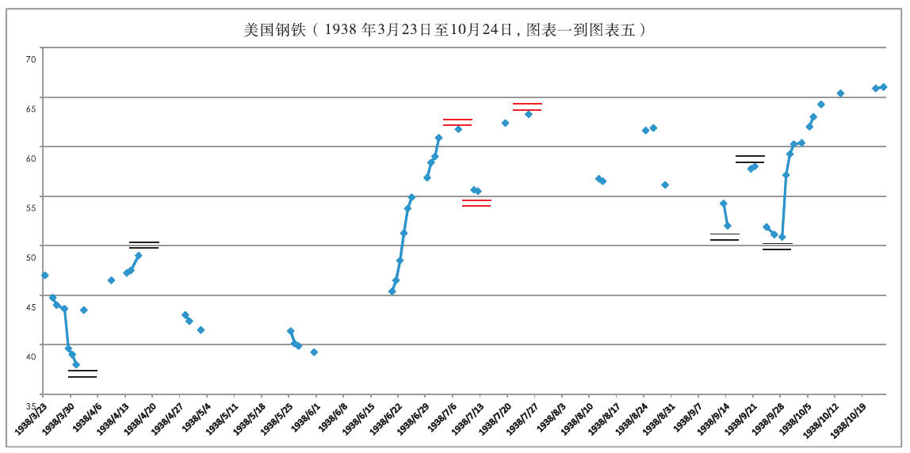
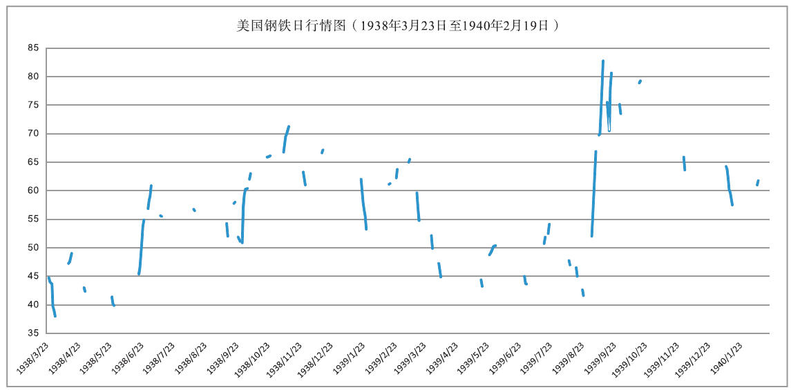
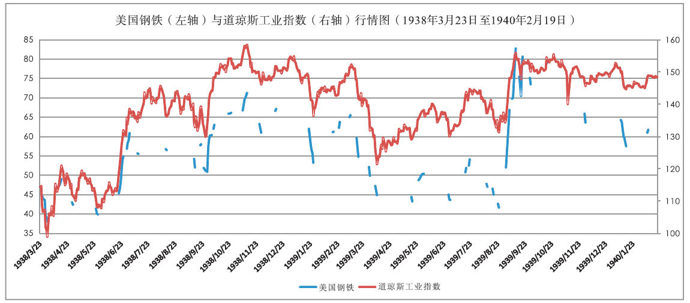

【译者注释】译者注释图1显示了美国钢铁从1938年3月23日开始（图表一）至1938年10月24日止（图表五）的日行情，每日只选取收市价，对应图表一到图表五。译者注释图1把原著附表中美国钢铁行情记录表复原为现代的行情图表。
```
利弗莫尔规则实际上对连续的行情数据进行了分类，分类的过程便是判断行情性质的过程。译者注释图1中有点的日子其价格变化符合利弗莫尔的记录规则，被记录在各栏中；没有点的日子，图表上是断续的，这些日子的行情变化在利弗莫尔的规则下相对不太重要，被忽略了。下降趋势调整阶段的关键点用双黑线标出；上升趋势的关键点用双红线标出。
```

【译者注释】译者注释图4显示了美国钢铁从1938年3月23日至1940年2月19日的行情，对应图表一到图表十六。译者注释图4把原著图表中的所有美国钢铁的行情数据连接在一起，以便于观察。


## 利弗莫尔规则始终以趋势为核心，突出趋势研判功能，把不提供趋势信息的小波动忽略掉。
【译者注释】译者注释图5显示了美国钢铁（左轴）与道琼斯工业指数（右轴）从1938年3月23日至1940年2月19日行情的对比图。最理想的对比是美国钢铁的完整行情和利弗莫尔的记录的对比。遗憾的是我们找不到完整的原始数据。
从译者注释图5的对比大致可以看出，利弗莫尔规则始终以趋势为核心，突出趋势研判功能，把不提供趋势信息的小波动忽略掉。在趋势明朗时紧密跟踪趋势，在趋势进入调整阶段后，密切观察调整阶段的终结以及随后趋势的持续或逆转。

